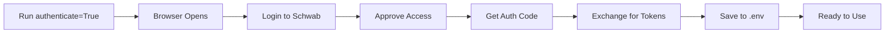

# 🏦 Schwab Trading API - Python Client

A production-ready Python client for the Charles Schwab Trader API with OAuth 2.0 authentication, account management, and order retrieval capabilities.

[](https://www.python.org/downloads/)
[](https://opensource.org/licenses/MIT)

## ✨ Features

- 🔐 **OAuth 2.0 Authentication** - Automatic token refresh and management
- 📊 **Account Management** - Retrieve account numbers and encrypted IDs
- 📈 **Order History** - Get orders with flexible date ranges and filtering
- 🎯 **Smart ID Handling** - Automatic conversion between plain and encrypted account IDs
- 📋 **Multiple Output Formats** - Tables, DataFrames, and JSON
- 🛡️ **Secure** - Environment variables for credentials, no hardcoded secrets
- 🎨 **User-Friendly** - Clean API with helpful error messages

## 📋 Table of Contents

- [Prerequisites](#prerequisites)
- [Installation](#installation)
- [Quick Start](#quick-start)
- [Project Structure](#project-structure)
- [Configuration](#configuration)
- [Usage Examples](#usage-examples)
- [API Documentation](#api-documentation)
- [Troubleshooting](#troubleshooting)
- [Contributing](#contributing)
- [License](#license)
- [Disclaimer](#disclaimer)

## 🔧 Prerequisites

### Required Accounts

1. **Schwab Developer Portal Account**
   - Sign up at [developer.schwab.com](https://developer.schwab.com/)
   - Request access to Trader API (approval takes 1-3 business days)

2. **Schwab Brokerage Account**
   - Your regular trading account for OAuth authorization

### System Requirements

- Python 3.7 or higher
- pip (Python package installer)
- Internet connection

## 📦 Installation

### 1. Clone the Repository

```bash
git clone https://github.com/venups/Schwab.git
cd Schwab
```

### 2. Install Dependencies

```bash
pip install -r requirements.txt
```

### 3. Set Up Environment Variables

Create a `.env` file in the `client` directory:

```bash
cp client/.env.example client/.env
```

Edit `client/.env` with your credentials:

```env
# Schwab API Credentials
APP_KEY=your_app_key_here
APP_SECRET=your_app_secret_here
APP_CALLBACK_URL=https://127.0.0.1
BASE_URL=https://api.schwabapi.com

# OAuth Tokens (will be auto-populated after first authentication)
AUTH_CODE_URL=
AUTH_CODE=
REFRESH_TOKEN=
ACCESS_TOKEN=
ID_TOKEN=
```

## 🚀 Quick Start

### First-Time Setup

1. **Get Your API Credentials:**
   - Log in to [developer.schwab.com](https://developer.schwab.com/)
   - Navigate to **Dashboard** → **Apps** → **My Apps**
   - Click **"Create App"** or open your existing app
   - Copy your **App Key** (Client ID) and **Secret**

2. **Run Initial Authentication:**

```python
from client.schwab_client import SchwabClient

client = SchwabClient()
client.handle_authentication(authenticate=True)  # First time only
```

This will:
- Open a browser authentication URL
- Prompt you to log in with your Schwab brokerage account
- Save your tokens to `.env` automatically

3. **Start Using the API:**

```python
from client.schwab_client import SchwabClient
from src.functions.accounting import Accounting
from src.functions.orders import Orders

# Initialize
client = SchwabClient()
accounting = Accounting()
orders = Orders()

# Authenticate (uses saved tokens)
client.handle_authentication(authenticate=False)

# Get account info
account_info = accounting.get_account_info()
print(f"Account: {account_info[0]['accountNumber']}")

# Get recent orders
encrypted_id = account_info[0]['hashValue']
recent_orders = orders.get_orders_by_days(encrypted_id, days=30)

# Display as table
orders.print_orders_table(recent_orders)
```

## 📁 Project Structure

```
schwab-trading-api/
│
├── client/
│   ├── .env                    # Your credentials (DO NOT COMMIT)
│   ├── .env.example            # Template for credentials
│   └── schwab_client.py        # OAuth client and authentication
│
├── src/
│   └── functions/
│       ├── accounting.py       # Account management
│       └── orders.py           # Order retrieval and filtering
│
├── main.py                     # Simple usage example
├── example_orders_usage.py     # Comprehensive examples
├── requirements.txt            # Python dependencies
├── README.md                   # This file
└── .gitignore                  # Git ignore rules
```

## ⚙️ Configuration

### Environment Variables

| Variable | Required | Description | Example |
|----------|----------|-------------|---------|
| `APP_KEY` | ✅ | Your Schwab App Key (Client ID) | `ABC123XYZ` |
| `APP_SECRET` | ✅ | Your Schwab App Secret | `secret123` |
| `APP_CALLBACK_URL` | ✅ | OAuth redirect URI | `https://127.0.0.1` |
| `BASE_URL` | ✅ | Schwab API base URL | `https://api.schwabapi.com` |
| `REFRESH_TOKEN` | Auto | OAuth refresh token | Auto-populated |
| `ACCESS_TOKEN` | Auto | OAuth access token | Auto-populated |

### Authentication Flow



**Token Lifespans:**
- **Access Token**: 30 minutes (auto-refreshed)
- **Refresh Token**: 7 days (requires manual re-authentication)

## 📖 Usage Examples

### Example 1: Get Account Information

```python
from client.schwab_client import SchwabClient
from src.functions.accounting import Accounting

client = SchwabClient()
accounting = Accounting()

client.handle_authentication(authenticate=False)

# Get all accounts
accounts = accounting.get_account_info()

for acc in accounts:
    print(f"Account: {acc['accountNumber']}")
    print(f"Encrypted ID: {acc['hashValue']}")
```

### Example 2: Get Orders from Last 30 Days

```python
from src.functions.orders import Orders
from src.functions.accounting import Accounting

orders = Orders()
accounting = Accounting()

# Get encrypted account ID
encrypted_id = accounting.get_encrypted_account_id()

# Get orders
orders_list = orders.get_orders_by_days(
    account_id=encrypted_id,
    days=30
)

# Display as table
orders.print_orders_table(orders_list)
```

### Example 3: Filter Orders by Status

```python
# Get only filled orders from last 60 days
filled_orders = orders.get_orders_by_days(
    account_id=encrypted_id,
    days=60,
    status="FILLED"
)

orders.print_orders_table(filled_orders)
```

### Example 4: Filter by Symbol

```python
# Get all orders, then filter by symbol
all_orders = orders.get_orders_by_days(encrypted_id, days=90)
spy_orders = orders.filter_orders_by_symbol(all_orders, "SPY")

print(f"Found {len(spy_orders)} SPY orders")
orders.print_orders_table(spy_orders)
```

### Example 5: Export to CSV

```python
import pandas as pd

# Get orders
orders_list = orders.get_orders_by_days(encrypted_id, days=30)

# Convert to DataFrame
df = orders.format_orders_summary(orders_list)

# Save to CSV
df.to_csv('my_orders.csv', index=False)
print("Orders exported to my_orders.csv")
```

### Example 6: Analyze Order Statistics

```python
# Get orders as DataFrame
orders_list = orders.get_orders_by_days(encrypted_id, days=90)
df = orders.format_orders_summary(orders_list)

# Analyze
print("Order Status Distribution:")
print(df['Status'].value_counts())

print("\nMost Traded Symbols:")
print(df['Symbol'].value_counts().head(10))

print("\nOrders by Type:")
print(df['Type'].value_counts())
```

### Example 7: Get Orders for Multiple Accounts

```python
# Get orders for all linked accounts
all_accounts_orders = orders.get_all_accounts_orders(days=30)

for account_num, account_orders in all_accounts_orders.items():
    print(f"\n📊 Account: {account_num}")
    print(f"   Total Orders: {len(account_orders)}")
    orders.print_orders_table(account_orders)
```

## 📚 API Documentation

### `SchwabClient`

OAuth 2.0 authentication client.

```python
client = SchwabClient()

# Authenticate (first time or expired tokens)
client.handle_authentication(authenticate=True)

# Use existing tokens (default)
client.handle_authentication(authenticate=False)

# Get authorization headers
headers = client.get_headers()
```

### `Accounting`

Account management and ID retrieval.

```python
accounting = Accounting()

# Get all account information
accounts = accounting.get_account_info()
# Returns: [{"accountNumber": "123...", "hashValue": "ABC..."}]

# Get encrypted ID for specific account
encrypted_id = accounting.get_encrypted_account_id("123456789")

# Get encrypted ID for first account
encrypted_id = accounting.get_encrypted_account_id()

# Get all account mappings
mapping = accounting.get_all_encrypted_ids()
# Returns: {"123456789": "ABC...", "987654321": "XYZ..."}
```

### `Orders`

Order retrieval and management.

```python
orders = Orders()

# Get orders by date range
orders_list = orders.get_orders_by_days(
    account_id=encrypted_id,    # Required: encrypted account ID
    days=30,                     # Optional: default 30
    max_results=3000,            # Optional: default 3000
    status="FILLED"              # Optional: filter by status
)

# Convenience method (auto-converts plain account number)
orders_list = orders.get_orders_by_plain_account(
    account_number="123456789",
    days=30
)

# Get orders for all accounts
all_orders = orders.get_all_accounts_orders(days=30)

# Filter orders
spy_orders = orders.filter_orders_by_symbol(orders_list, "SPY")
filled_orders = orders.filter_orders_by_status(orders_list, "FILLED")

# Display orders
orders.print_orders_table(orders_list)

# Get as DataFrame
df = orders.format_orders_summary(orders_list)

# Get as JSON
json_str = orders.get_orders_json(encrypted_id, days=30, pretty=True)
```

### Available Order Statuses

Filter orders using these status values:

- `FILLED` - Order executed
- `WORKING` - Order active in market
- `CANCELED` - Order canceled
- `REJECTED` - Order rejected
- `EXPIRED` - Order expired
- `PENDING_ACTIVATION` - Pending activation
- `QUEUED` - In queue
- `ACCEPTED` - Accepted by broker
- Plus 10+ more (see API docs)

## 🔍 Troubleshooting

### Issue: "Invalid account number"

**Error:**
```
❌ HTTP Error: 400 Client Error: Bad Request
Response: {"message":"Invalid account number"}
```

**Cause:** Using plain account number instead of encrypted ID

**Fix:**
```python
# ❌ Wrong
orders.get_orders_by_days("123456789", days=30)

# ✅ Correct
encrypted_id = accounting.get_encrypted_account_id()
orders.get_orders_by_days(encrypted_id, days=30)
```

### Issue: "401 Unauthorized"

**Cause:** Access token expired

**Fix:**
```python
# Re-authenticate
client.handle_authentication(authenticate=False)
```

### Issue: "invalid_grant" or refresh token expired

**Cause:** Refresh token expired (7 days old)

**Fix:**
```python
# Run full authentication flow again
client.handle_authentication(authenticate=True)
```

### Issue: No orders returned

**Possible causes:**
1. No orders in specified date range
2. Status filter too restrictive
3. Account has no trading activity

**Debug:**
```python
# Try wider date range
orders.get_orders_by_days(encrypted_id, days=365)

# Try without status filter
orders.get_orders_by_days(encrypted_id, days=30)
```

### Issue: Rate limit errors (429)

**Cause:** Too many API requests

**Limits:**
- Market data: ~120 requests/minute
- Trading: 2-4 requests/second

**Fix:**
- Add delays between requests
- Implement exponential backoff
- Cache results when possible

## 🔐 Security Best Practices

1. **Never commit `.env` file**
   ```bash
   # Add to .gitignore
   client/.env
   *.env
   ```

2. **Use environment variables**
   - Never hardcode credentials in code
   - Use `os.getenv()` to read values

3. **Secure token storage**
   - Keep `.env` file permissions restricted
   - Rotate tokens regularly (every 7 days)

4. **HTTPS only**
   - Always use `https://` for redirect URIs
   - Schwab enforces HTTPS for OAuth

## 🛠️ Development

### Running Tests

```bash
# Run the example script
python example_orders_usage.py

# Run your main script
python main.py
```

### Adding New Features

1. Fork the repository
2. Create a feature branch
3. Make your changes
4. Test thoroughly
5. Submit a pull request

## 📝 Requirements

```txt
requests>=2.31.0
python-dotenv>=1.0.0
tabulate>=0.9.0
pandas>=1.5.0
```

## 🤝 Contributing

Contributions are welcome! Please:

1. Fork the repository
2. Create a feature branch (`git checkout -b feature/amazing-feature`)
3. Commit your changes (`git commit -m 'Add amazing feature'`)
4. Push to the branch (`git push origin feature/amazing-feature`)
5. Open a Pull Request

### Code Style

- Follow PEP 8
- Use type hints where appropriate
- Add docstrings to all functions
- Include error handling

## 📄 License

This project is licensed under the MIT License - see the [LICENSE](LICENSE) file for details.

## ⚠️ Disclaimer

**Important:** This is unofficial, community-maintained code and is not affiliated with or endorsed by Charles Schwab & Co., Inc.

- Use at your own risk
- Test thoroughly before using in production
- The Schwab API and its terms of service are subject to change
- Always verify trades manually before execution
- No warranty or guarantee is provided

For official documentation, visit:
- [Schwab Developer Portal](https://developer.schwab.com/)
- [Schwab API Documentation](https://developer.schwab.com/products/trader-api)

## 🌟 Acknowledgments

- Built with the [Schwab Trader API](https://developer.schwab.com/)
- Inspired by [schwab-py](https://github.com/alexgolec/schwab-py) project
- Thanks to the Schwab developer community

## 📧 Support

- **Issues:** [GitHub Issues](https://github.com/yourusername/schwab-trading-api/issues)
- **Discussions:** [GitHub Discussions](https://github.com/yourusername/schwab-trading-api/discussions)
- **Schwab API Support:** traderapi@schwab.com

## 🗺️ Roadmap

- [ ] Add order placement functionality
- [ ] Add streaming quotes support
- [ ] Add position management
- [ ] Add options chain retrieval
- [ ] Add automated testing
- [ ] Add Docker support
- [ ] Add command-line interface

---

**Made with ❤️ by the trading community**

⭐ If you find this helpful, please star the repository!
